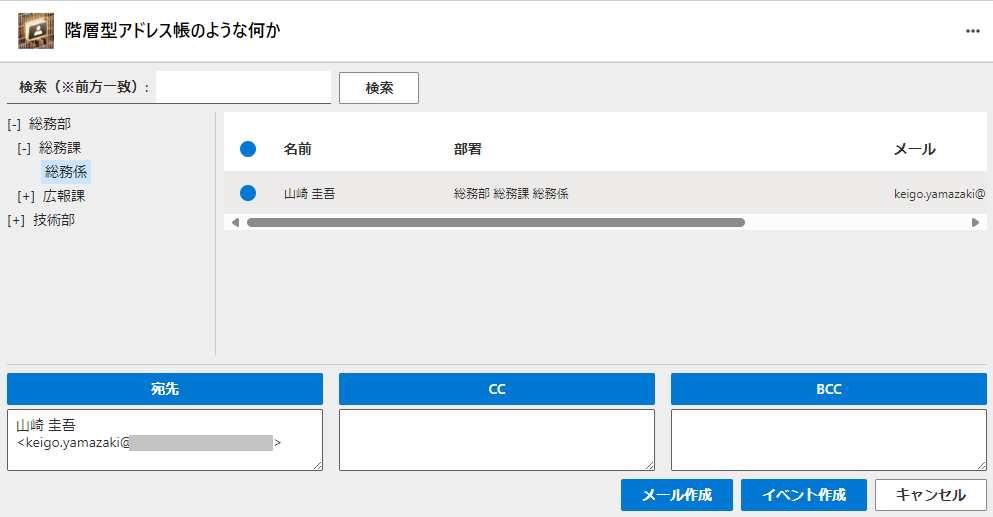

#  AddrTree:階層型アドレス帳のような何か について

<u>本アプリは現状のまま提供され、不具合その他動作の保証は一切いたしません。</u>

- 階層型アドレス帳のような何かです。
- Teams や Outlook の 「統合アプリ」 （タブ）として動作します（ 「アドイン」ではありません）。
- Entra ID の「ジョブ情報」 の 「部署」 （department）に半角スペース区切りで部署名が登録されている必要があります。
- 管理者はこのアプリに対して Graph の User.Read.All の ユーザに委任された権限を承認する必要があります。

## 実行方法（ソースコードから）

1. Microsoft の Visual Studio Code (vscode) をインストールします。
2. vscode に、Microsoft Teams Toolkit 拡張機能をインストールします。
3. このアプリをダウンロードしたフォルダを開きます。
4. localhostで実行したり、検証環境にプロビジョニング、デプロイ、発行などができます。

## 実行方法（デモ環境から）

デモ環境 https://addrtree.foobar.zip/termsofuse.html から実行することもできるかも知れません。

by Keigo YAMAZAKI (@ymzkei5)
